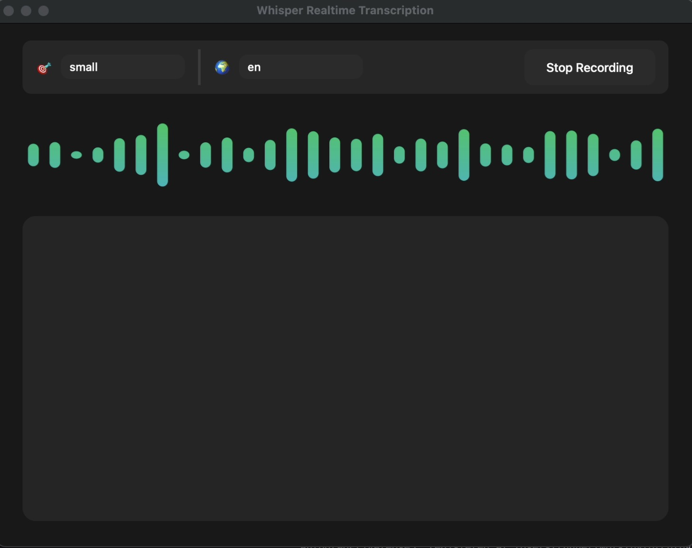

<div align="center">
  <h1>Whisper Realtime Transcription GUI</h1>
  <p>Application de reconnaissance vocale en temps réel avec une interface utilisateur moderne</p>
  <p>Real-time speech recognition application with a modern user interface</p>
  
  
  
  <div>
    <a href="#français">Français</a> | 
    <a href="#english">English</a>
  </div>
</div>

---

<a id="français"></a>
## 🌐 Français

### 📝 Description
Une application de reconnaissance vocale en temps réel basée sur Whisper d'OpenAI et PySide6. Cette application offre une interface utilisateur moderne et élégante pour la transcription audio en temps réel avec support multilingue.

### ✨ Fonctionnalités

- 🎙 Transcription audio en temps réel avec Whisper d'OpenAI
- 🌈 Interface utilisateur moderne avec visualiseur audio animé
- 🚀 Accélération GPU (Apple Silicon/CUDA)
- 🌍 Support multilingue (Anglais, Français, Vietnamien)
- 📊 Visualisation en temps réel des ondes sonores
- 💫 Animations et transitions fluides
- 🎯 Plusieurs modèles Whisper disponibles (tiny, base, small, medium, large)
- ⚡️ Optimisation pour le streaming en temps réel
- 🎨 Retour visuel amélioré avec effets lumineux

### 📦 Installation

#### Pour les utilisateurs macOS
1. Téléchargez le fichier `.dmg` depuis la page [Releases](https://github.com/phongthanhbuiit/whisper-realtime-gui/releases)
2. Ouvrez le fichier `.dmg` téléchargé
3. Glissez l'application dans votre dossier Applications
4. Double-cliquez pour lancer l'application

#### Pour les développeurs
1. Clonez le dépôt :
```bash
git clone https://github.com/phongthanhbuiit/whisper-realtime-gui.git
cd whisper-realtime-gui
```

2. Créez et activez un environnement virtuel :
```bash
python -m venv venv
source venv/bin/activate  # Sur macOS/Linux
```

3. Installez les dépendances :
```bash
pip install -r requirements.txt
```

### 🚀 Utilisation

1. Activez l'environnement virtuel :
```bash
source venv/bin/activate
```

2. Lancez l'application :
```bash
python whisper_gui.py
```

3. Sélectionnez votre modèle et langue préférés
4. Cliquez sur "Démarrer l'enregistrement"
5. Parlez dans votre microphone
6. Regardez la transcription en temps réel et la visualisation des ondes

---

<a id="english"></a>
## 🌐 English

### 📝 Description
A modern, real-time speech recognition application built with OpenAI's Whisper and PySide6. This application provides a beautiful, native-looking interface for transcribing audio in real-time with support for multiple languages.

### ✨ Features

- 🎙 Real-time audio transcription using OpenAI's Whisper
- 🌈 Beautiful, modern UI with animated audio visualizer
- 🚀 GPU acceleration support (Apple Silicon/CUDA)
- 🌍 Multi-language support (English, French, Vietnamese)
- 📊 Live audio waveform visualization with dynamic effects
- 💫 Smooth animations and transitions
- 🎯 Multiple Whisper model options (tiny, base, small, medium, large)
- ⚡️ Optimized streaming for better real-time performance
- 🎨 Enhanced visual feedback with glowing effects

### 📦 Installation

#### For macOS Users
1. Download the latest `.dmg` file from the [Releases](https://github.com/phongthanhbuiit/whisper-realtime-gui/releases) page
2. Open the downloaded `.dmg` file
3. Drag the application to your Applications folder
4. Double click to run the application

#### For Developers
1. Clone the repository:
```bash
git clone https://github.com/phongthanhbuiit/whisper-realtime-gui.git
cd whisper-realtime-gui
```

2. Create and activate a virtual environment:
```bash
python -m venv venv
source venv/bin/activate  # On macOS/Linux
```

3. Install the required packages:
```bash
pip install -r requirements.txt
```

### 🚀 Usage

1. Activate the virtual environment if not already activated:
```bash
source venv/bin/activate  # On macOS/Linux
```

2. Run the GUI application:
```bash
python whisper_gui.py
```

3. Select your preferred model and language from the dropdown menus
4. Click "Start Recording" to begin transcription
5. Speak into your microphone
6. Watch the beautiful waveform animation and real-time transcription

---

## 📝 Release Information
Choose from different Whisper models based on your needs:
- `tiny`: Fastest, lowest accuracy (good for testing)
- `base`: Good balance of speed and accuracy
- `small`: Better accuracy, still reasonable speed
- `medium`: High accuracy, slower processing
- `large`: Best accuracy, requires more resources

### 🌍 Language Support
- English
- French
- Vietnamese

The language can be changed in real-time during transcription.

### 💡 Performance Tips

1. **Model Selection**:
   - Start with `tiny` or `base` model for testing
   - Use `small` for general use
   - Use `medium` or `large` only if you need highest accuracy

2. **GPU Acceleration**:
   - The app automatically uses GPU if available
   - Recommended for `medium` and `large` models

3. **Audio Input**:
   - Speak clearly and at a moderate pace
   - Keep microphone at a consistent distance
   - Avoid background noise for better accuracy

### 🔧 Troubleshooting

If you encounter issues:

1. **Audio Not Detected**:
   - Check your microphone permissions
   - Verify input device in system settings

2. **Slow Performance**:
   - Try a smaller model
   - Ensure GPU acceleration is working
   - Check CPU/Memory usage

3. **Transcription Issues**:
   - Try changing the language setting
   - Speak more clearly
   - Adjust your microphone position

## 📝 Release Information

- Version: 1.0.0
- Date de sortie / Release Date: 2023-02-20
- Modifications / Changes:
  - Version initiale avec transcription en temps réel et conversion de fichiers
  - Initial release with real-time transcription and file conversion features

## 🤝 Contributing / Contribution

Contributions are welcome! Please feel free to submit a Pull Request.

Les contributions sont les bienvenues ! N'hésitez pas à soumettre une Pull Request.

## 📜 License / Licence

This project is licensed under the MIT License - see the [LICENSE](LICENSE) file for details.

Ce projet est sous licence MIT - voir le fichier [LICENSE](LICENSE) pour plus de détails.

## 🙏 Remerciements / Acknowledgments

- [OpenAI Whisper](https://github.com/openai/whisper) - Pour l'incroyable modèle de reconnaissance vocale / For the amazing speech recognition model
- [PySide6](https://www.qt.io/qt-for-python) - Pour le framework d'interface graphique / For the GUI framework
- [numpy](https://numpy.org/) - Pour les opérations numériques / For numerical operations
- [sounddevice](https://python-sounddevice.readthedocs.io/) - Pour le streaming audio / For audio streaming
- [scipy](https://www.scipy.org/) - Pour le traitement du signal / For signal processing

## ❓ Support / Aide

For support, please [open an issue](https://github.com/phongthanhbuiit/whisper-realtime-gui/issues) on GitHub.

Pour obtenir de l'aide, veuillez [ouvrir un ticket](https://github.com/phongthanhbuiit/whisper-realtime-gui/issues) sur GitHub.

## ⭐

Si ce projet vous a été utile, n'hésitez pas à lui donner une étoile !

If you found this project helpful, please give it a star!
